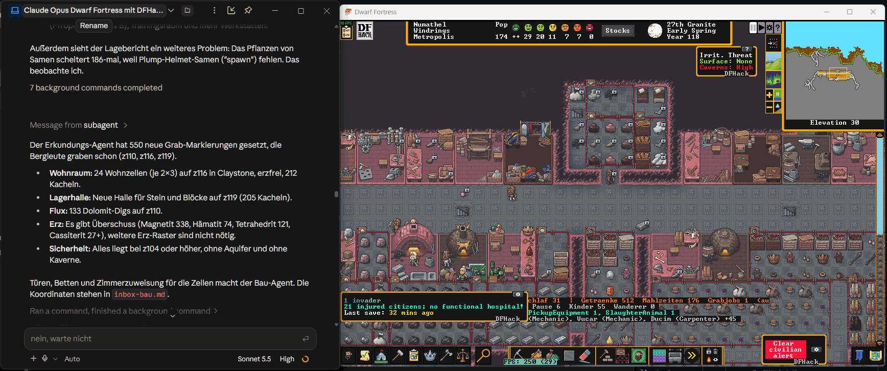
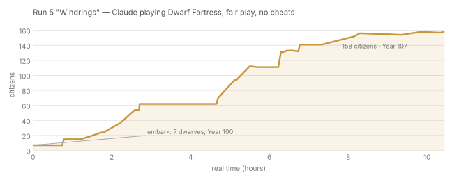

# df-llm-helper

**Claude ran a real game of Dwarf Fortress for 10 hours: from 7 dwarves to 158 citizens over seven in-game years, with cheat commands blocked in code.** This repo is the layer that made it possible.



<sub>Left: Claude as orchestrator, reporting what its sub-agents did (new dig designations, living quarters, storage hall). Right: the same fortress, still alive in Year 118 with 174 citizens and Metropolis rank.</sub>



<sub>The first 10 hours of that fortress, real data from `fixtures/run5_live/metrics_run5.csv` (DF 53.16 + DFHack, 2026).</sub>

## Why this exists

**To save tokens and to control the game faster.** Without a helper, every check means the LLM reads raw status dumps, re-reads its notes and re-derives known fixes, and every routine fix costs a full LLM turn. That is expensive, and it is slow: an LLM turn takes seconds to minutes, while a Dwarf Fortress fortress can get into trouble in a few in-game days.

df-llm-helper moves everything that does not need judgement out of the LLM:

| Task | Without helper | With df-llm-helper |
|---|---|---|
| Situation check | read 8–15 KB of status/report/inbox ≈ 3–5k tokens | delta report ≤ 600 tokens (Run 5 sample: ~170); "no change" ≈ 15 tokens |
| Routine fixes (flags, services, fps, stockpiles…) | one LLM turn each, ~1–3k tokens | **0 tokens**, autopilot rules |
| Knowledge for one symptom | read a whole notes file (30–100 KB) | `kb search` / `runbook diagnose` ≤ 400 tokens |
| Starting a sub-agent | read 15–40 KB of docs ≈ 5–12k tokens | `brief <scope>` ≤ 1,500 tokens |
| Reaction time | next LLM check (minutes) | watcher every 2 s, deterministic |

<sub>"Without helper" figures are the measured/estimated baseline from the runs before, see `docs/SPEC.md` §7; token ≈ characters / 3.</sub>

How it gets there:

- **One call, one short report.** `check` collects the whole game state in one batched call and returns only what changed, what is urgent and what is still open.
- **Routine runs itself.** Maintenance rules (food flags, stockpiles, caravans, moods, sieges, water…) run on an autopilot with cooldowns and loop protection. Every write action is logged with its reason.
- **Known problems have runbooks.** `runbook diagnose` matches symptoms to fixes learned in earlier runs, instead of the LLM working them out again.
- **The LLM sleeps until it is needed.** `wake` filters events down to decision-ready ones; a deadman switch and tempo governor slow the game when the orchestrator stops checking in. (Run 4 died exactly that way: years at 250 fps with nobody watching.)
- **Fair play is enforced in code**, not by prompt. `createitem`, `dig-now`, `reveal` and friends are refused by the client and a Lua linter.

```
 LLM agent (Claude, …)  ──  python -m df_llm_helper check / runbook / brief …
          │                                │
          │  decisions                     │  ≤ 600-token delta reports, wake-up events
          ▼                                ▼
                  df-llm-helper (Python, stdlib only)
          autopilot · guard · watcher · runbooks · fair-play linter
                               │
                        dfhack-run + Lua scripts
                               │
                         Dwarf Fortress
```

## Try it in 30 seconds (no game needed)

Recorded answers from the real Run 5 fortress ship with the repo, so everything works without Dwarf Fortress:

```
git clone https://github.com/GordonMohrin/df-llm-helper && cd df-llm-helper
python -m df_llm_helper --mock fixtures/run5 check
```

```
Status Y102 Hematite 12 | Pop 24 (7 idle 30%) | Drinks 76d Food 189d | Jobs 199 (dig 63, 3 digging) | fps 250 | PAUSE
!! Hunger>40k: Tekkud414=47k, Eral3473=40k
! Caravan Muboomon: Approaching, 3055 ticks (prepare trade)
```

That is what the LLM sees every five minutes instead of the raw game. More:

```
python -m df_llm_helper --mock fixtures/run5 runbook diagnose
python -m df_llm_helper --mock fixtures/run5 dashboard --out runtime/dashboard.html
python -m df_llm_helper.selftest                            # full test suite (~10 s), needs pytest
```

Requirements: Python 3.11+, standard library only (pytest for tests; `lua5.4` optional for Lua tests). Run all commands from the project folder; the package was formerly called *dfpilot* (`DFPILOT_HOME` still works as an alias for `DF_LLM_HELPER_HOME`).

## What it does

| Area                                        | Commands                                                                                                                                                                   |
| ------------------------------------------- | -------------------------------------------------------------------------------------------------------------------------------------------------------------------------- |
| Situation report (≤ 600 tokens, delta only) | `check`, `digest`, `cycle`                                                                                                                                                 |
| Maintenance autopilot with loop protection  | `autopilot`, `guard`, `waechter` (real-time watcher), `tempo`                                                                                                              |
| Knowledge                                   | `runbook diagnose/show/run`, `kb search`, `brief <scope>` (agent briefing ≤ 1500 tokens)                                                                                   |
| Agents                                      | `agents prompt/lint-report/cost`, `bus` (message bus), `memory compact`                                                                                                    |
| Autopilots (v2)                             | `siege`, `caravan`, `trade`, `mood`, `care`, `workload`, `bottleneck`, `water`, `reboot`                                                                                   |
| Autopilots (v3)                             | `perimeter`, `digcheck`, `reach`, `perf`, `tools`, `remote`, `hygiene`, `defense`, `settings`, `camera`; standstill/window guard inside `waechter` – see `docs/manual-v3/` |
| Reporting                                   | `forecast`, `dashboard` (static HTML), `journal` (chronicle, lessons, post-mortem), `metrics`, `budget`                                                                    |
| Fair play                                   | `lint` (30+ rules on Lua), exception register `exception list/add`                                                                                                         |

Every rule has a `max_per_hour`; a rule that fires too often switches itself off and raises a warning. Full reference: `docs/MANUAL.md`, `docs/OVERVIEW.md`.

## Against a real game

1. `cp config.yaml.example config.yaml`, set `dfhack_run` and `paths.gamelog`; fortress-specific values (squad name, water boxes, rally point) go there too.
2. Copy `lua/pilot_*.lua` and `lua/claude/*.lua` to `<Dwarf Fortress>/hack/scripts/claude/` and set the environment variable `DF_LLM_HELPER_HOME` (shared folder for flags/logs) – see **`COMPANION.md`**.
3. Adjust the fortress-specific values in `lua/claude/config.lua` after embark (example values ship from the original fortress).
4. Orchestrator loop: `python -m df_llm_helper check` every 5 minutes, `python -m df_llm_helper waechter --loop` as a background process, `python -m df_llm_helper wake --loop` as the wake-up filter. Details: `docs/MANUAL.md`, start prompt for agents: `docs/AGENT-PROMPT.md`.

**Bring your own agent.** This repo is the helper layer, not the orchestrator. Any LLM agent that can run shell commands can drive it; Run 5 used Claude as orchestrator with scope sub-agents (military, trade, construction, …).

## Fair play

Only what a human player could do through the UI: designations, build orders, stockpiles, work orders, labors, squads, alerts, trading, quickfort with *own* blueprints, DFHack convenience automation. Refused by the linter and the client: `createitem`, `dig-now`, `build-now`, `reveal`, `prospect all`, direct unit/item manipulation. Exceptions only via an entry in `data/exceptions.jsonl` that quotes the human player's explicit consent.

## Status

- Core (M1–M3) is live-tested; v2 and v3 autopilots are tested against recorded data, their Lua parts are marked *live-untested* (`docs/INTEGRATION.md` lists the live checks). See `CHANGELOG.md`, open deviations included.
- Some Lua output keys and in-game texts are still German (they are part of the protocol between Lua and Python); all user-facing Python output is English.
- Specs: `docs/SPEC.md`, `docs/specs-v2/`, `docs/specs-v3/`.

## Contributing

Issues and PRs welcome, especially live test reports for the *live-untested* parts, runbooks from your own fortress, and experiences with other LLMs as orchestrator. Bug report template: `Bugs/TEMPLATE.md`.

## Layout

```
df_llm_helper/  Python package (CLI: python -m df_llm_helper)
lua/            DFHack scripts: pilot_*.lua + companion toolkit lua/claude/*.lua
tools/          luacheck_min.py (Lua structure check), embark/ (menu automation without a desktop)
data/           rules, runbooks, knowledge base, graphs, scopes, services
fixtures/       real recorded game answers (Run 5), anonymised agent transcripts
scenarios/      replay scenarios; tests/  pytest suite incl. a minimal DFHack mock for Lua
docs/           manual, overview, specs, integration checklist
```

## License

Public domain ([The Unlicense](LICENSE)) – do whatever you want with it.
